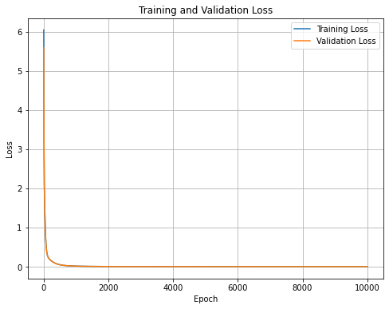

# ICNN-Darcy_Weisbach
Input-Convex Neural Network (ICNN) for modelling friction loss in water distribution networks based on the Darcy-Weisbach equation.
## Overview
This repository contains the Python implementation developed for my Master's thesis at Wageningen University & Research. The project explores the use of an Input-Convex Neural Network (ICNN) to approximate friction loss in water distribution networks.
The model uses flow rate and pipe diameter as inputs and predicts friction loss based on data generated from the Darcy-Weisbach equation.
## Methodology
The workflow consists of:
1. Generating synthetic data from the Darcy-Weisbach equation.
2. Preprocessing and normalising the input and output variables.
3. Training an Input-Convex Neural Network using PyTorch.
4. Evaluating model performance using training, validation and test datasets.
5. Comparing predicted friction loss with the reference values calculated from the physical equation.
## Model
The ICNN takes two input variables:
- Flow rate
- Pipe diameter
and predicts:
- Friction loss

The network architecture used in this implementation consists of four hidden layers with 5, 10, 5 and 2 neurons, respectively.

## Results
### Training and validation loss



### Predicted vs. reference friction loss


## Requirements

The code requires Python and the following packages:

- NumPy
- pandas
- Matplotlib
- scikit-learn
- PyTorch

Install the dependencies with:

```bash
pip install -r requirements.txt
